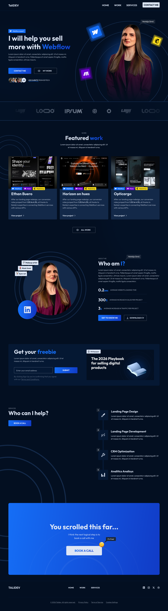

# Portfolio-Website
Modern portfolio website UI/UX design created in Figma, focused on clean layout, strong visual hierarchy and responsive design (desktop, tablet, mobile). The project demonstrates the use of Auto Layout, component-based structure and consistent spacing system to create a scalable and user-friendly interface.

## Tools & Skills
- Figma (Auto Layout, Components)
- UI/UX Design
- Responsive Design
- Layout & Spacing Systems

## Live Preview
[https://www.figma.com/proto/...](https://www.figma.com/proto/Ll9lqKufGHGgqC5ycgVEEz/Portfolio-sajt?node-id=274-2&t=SovM7Z5GsNdWRlo9-1)

## Design File
[https://www.figma.com/design/...](https://www.figma.com/design/Ll9lqKufGHGgqC5ycgVEEz/Portfolio-sajt?node-id=274-2&m=dev&t=SovM7Z5GsNdWRlo9-1)

## Preview

  

  
  

